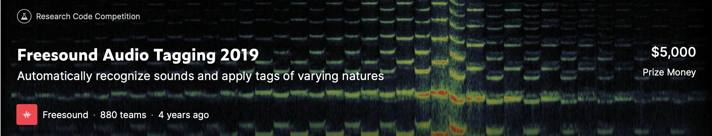

# Kaggle Freesound Audio Tagging 2019

[Kaggle page](https://www.kaggle.com/c/freesound-audio-tagging-2019)

Here's the background: Some sounds are distinct and instantly recognizable, like a baby’s laugh or the strum of a guitar. Other sounds are difficult to pinpoint. If you close your eyes, could you tell the difference between the sound of a chainsaw and the sound of a blender?

To tackle this problem, Freesound (an initiative by MTG-UPF that maintains a collaborative database with over 400,000 Creative Commons Licensed sounds) and Google Research’s Machine Perception Team (creators of AudioSet, a large-scale dataset of manually annotated audio events with over 500 classes) have teamed up to develop the dataset for this new competition.

To win this competition, Kagglers will develop an algorithm to tag audio data automatically using a diverse vocabulary of 80 categories.

### Results of the different models based on spectral features

**lgbm_model** folder contains
LightGBM with part_time_features and spectral_features

**lstm_model** folder contains
LSTM+Attention with melspectrogram or mcc or stft as features
